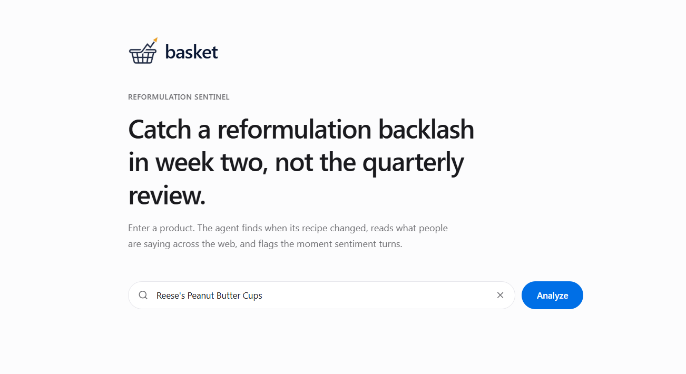
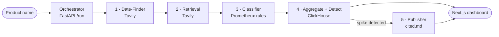
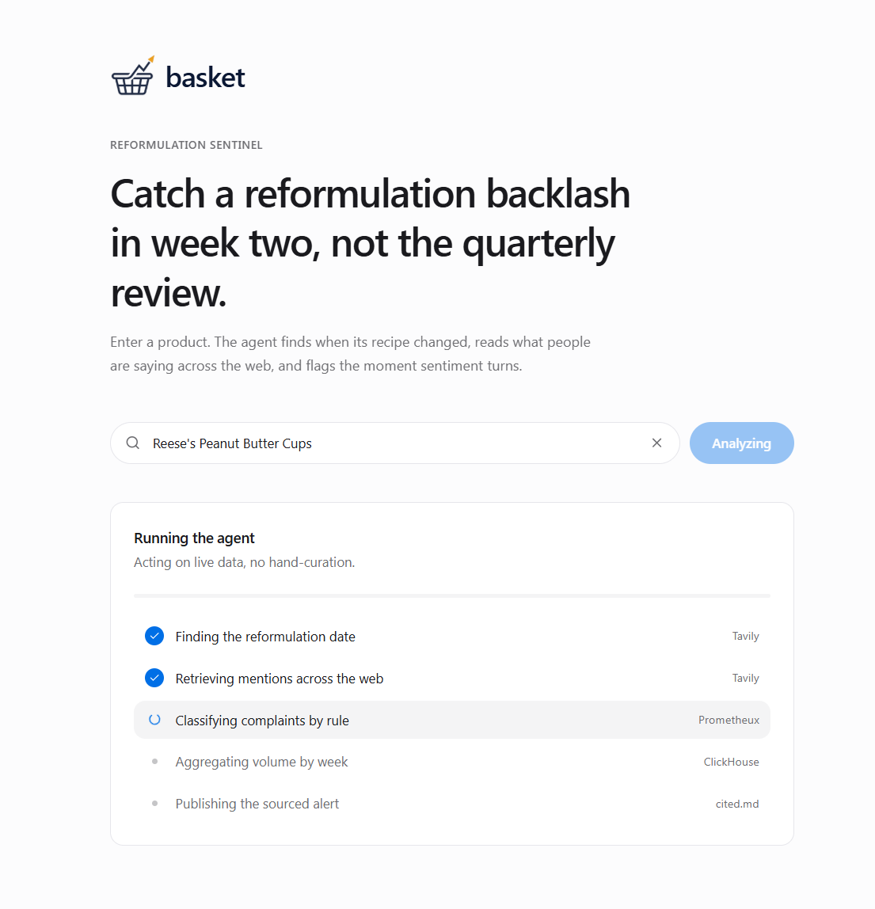

# 🧺 Basket — Reformulation Sentinel


An autonomous multi-agent system that catches botched product reformulations **weeks before they show up in sales data**, then publishes a sourced alert.

Give it a product name. The agent finds when the product was reformulated, watches live public sentiment across the web, detects the moment complaints spike, and publishes a cited report — early enough for a category manager to react in **week two** instead of the quarterly review.



## How it works

An orchestrator (Agent 0) drives five specialist agents over live web data:



| # | Agent | Tool | Role |
|---|-------|------|------|
| 1 | **Date-Finder** | Tavily | Finds when the product was reformulated, from a name alone. |
| 2 | **Retrieval** | Tavily | Searches and cleans complaint mentions across news and the web. |
| 3 | **Classifier** | Prometheux | Rule-classifies each complaint by type, with a traceable reason. |
| 4 | **Aggregator/Detector** | ClickHouse | Rolls complaints up by week × category and detects the spike. |
| 5 | **Publisher** | cited.md | Publishes a sourced alert when an inflection is detected. |



## Sponsor tools

- **Tavily** — live web retrieval. Source-biased searches find both the reformulation date and dated complaint coverage, and extract clean text from messy pages. This is what makes it a real web agent acting on live data, not a script over a static file.
- **Prometheux** — ontology and declarative rule classification. Resolves product variants and classifies each complaint with a literal rule trace back to the source text and date, so a judge can see exactly why a complaint was counted.
- **ClickHouse** — real-time aggregation. One `complaints` MergeTree table; the week × category rollup that powers the chart and the inflection detection (peak vs pre-reformulation baseline) both run as SQL, recomputed as new complaints stream in. Idempotent ingestion via `uniqExact(source_url)`.
- **cited.md** — publishes the action: a sourced report where each claim links back to its source.

Every layer degrades gracefully — the pipeline falls back to local classification and aggregation if a sponsor service is unavailable, so the demo always runs.

## Demo target (validated)

Reese's Peanut Butter Cups (Hershey), recipe change surfacing February 2026. See `TEAM.md`.

## Setup

```bash
pip install -r requirements.txt
cp .env.example .env        # fill TAVILY_API_KEY, CLICKHOUSE_HOST, CLICKHOUSE_PASSWORD, SENSO_API_KEY

# run the orchestrator (serves the /run contract the UI consumes)
uvicorn orchestrator:app --reload --port 8000

# or run the full pipeline once from the CLI
python -m agent.pipeline "Reese's Peanut Butter Cups"

# validate retrieval + dates for a product
python -m scripts.validate "Reese's Peanut Butter Cups" --reform-date 2026-02-17

# verify the ClickHouse layer
python -m scripts.clickhouse_check "Reese's Peanut Butter Cups" --reform-date 2026-02-17
```

UI:

```bash
cd ui
npm install
npm run dev        # http://localhost:3000
```

## Repo layout

```
orchestrator.py        Agent 0: FastAPI /run — drives the agents, returns the contract
publisher.py           Agent 5: cited.md publisher (sourced alert)
agent/
  tavily_agent.py      Agents 1-2: Date-Finder + Retrieval (Tavily)
  px_classify.py       Agent 3: Prometheux classifier
  classify.py          Agent 3 local stand-in (rules)
  clickhouse_store.py  Agent 4: ClickHouse aggregation + inflection
  aggregate.py         Agent 4 local fallback (no ClickHouse needed)
  pipeline.py          CLI runner over the agents
  schemas.py           The frozen data contract shared across agents
classifier/            Prometheux Vadalog rules, client, fixtures, tests
scripts/
  validate.py          Data-validation harness (is the spike real?)
  clickhouse_check.py  ClickHouse health + aggregation check
ui/                    Next.js dashboard (React, shadcn/ui, Tailwind)
```
